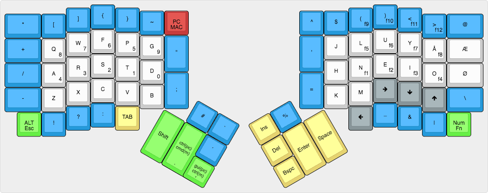

# Norwegian Colemak setup with osx/pc toggle

## Motivation
I wanted a Norwegian Colemak setup that worked in a similar way on both my Mac and PC. I also wanted the keyboard to translate from a standard Norwegian keyboard OS setup.

## Overview
The setup is created to be programmer friendly.
- Most of the symbols used in code can be activated without using layers or shift key.
- You can reach the IDE/OS shortcut activators(Ctrl, Win/Cmd, Alt, Shift) with the thumb or the wrist.
- Navigation is prioritized, arrows below the home row.

## PC/Mac toggle
The default setup is for Norwegian keyboard setting(not colemak software variants) on a PC(Windows or Linux) or Mac. Use the Mac/PC toggle button to switch between OSX and PC setup. The settings will be reverted to PC setup each time you restart/connect the keyboard.

## Layers
Since symbols are prioritized in this setup, numbers and function keys are on a new layer. The easiest way to use the layer switch(and also the alt key), is to push your hand right below the little finger, on the key. You will then have all your fingers free to type numbers or press function keys.

## Tap-shift
Tap for the next character to be shifted, hold down for regular shift.

## Comma dot and escape
Comma, dot and escape share buttons with modifier keys. Tap to access these keys, hold down to use the keys as modifier keys.

## Numpad symbols
+-/* are implemented with the numpad keycodes. The benefit is that they will work better with shortcuts in certain programs. For some reason, the default setting in the osx terminal is to not accept numpad characters for '/' and '-'. For a solution, see https://discussions.apple.com/thread/6613968?start=0&tstart=0.
If you really need the norwegian symbols in a program, you can access them using the number toggle button. 

## Layout

